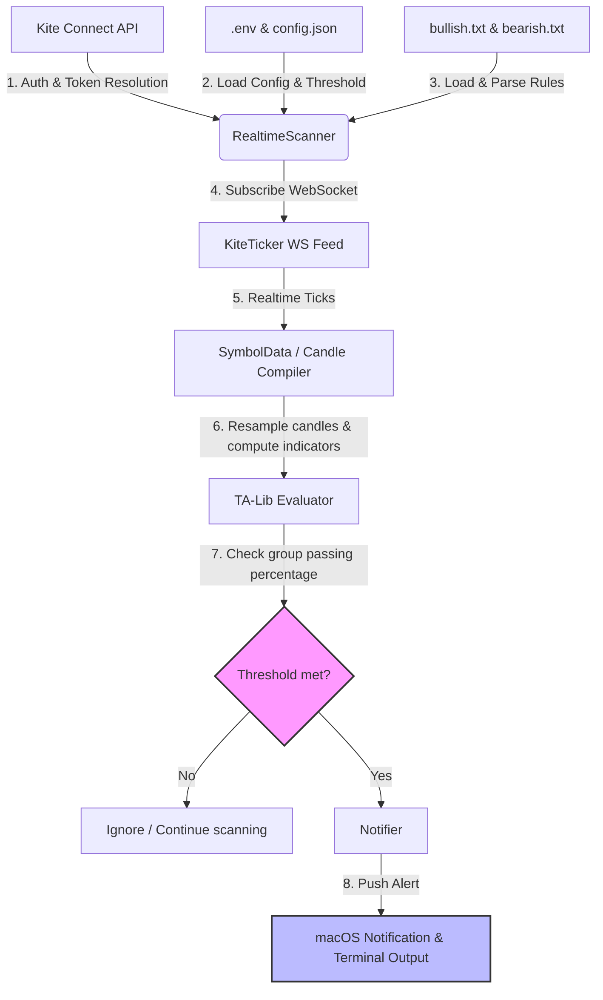

# Kite WebSocket Realtime Scanner (BasilTests)

A real-time technical analysis scanner built on top of **Kite Connect** and **TA-Lib**. The scanner subscribes to live stock market feeds via WebSockets, builds multi-interval candles (`1m`, `5m`, `15m`, `1h`, `4h`, `1d`) on-the-fly, evaluates sets of complex indicator conditions, and triggers threshold-based desktop notifications.

---

## Architecture & End-to-End Flow

Here is how the data flows through the application in real-time:



### Flow Step-by-Step:
1. **Startup & Resolution:** `scanner.py` reads `config.json` for target trading symbols (e.g. `NSE:RELIANCE`) and resolves them into numeric Kite `instrument_token`s.
2. **Historical Data Pre-fetch:** The scanner queries which intervals are needed by the active conditions (e.g. `5m`, `15m`, `1h`, `4h`, `1d`). It pre-fetches historical candles for each interval so that indicators (like MACD, Stochastic, or RSI) can be calculated immediately on the first tick.
3. **WebSocket Subscription:** The scanner establishes a connection via `KiteTicker` and subscribes to the full-depth ticks for all resolved symbols.
4. **Candle Compiling & Live Updates:** 
   * As ticks arrive, they are piped into `SymbolData`. 
   * It buckets ticks to form OHLC candles for active intervals.
   * The current forming candle is updated in real-time. The closing price is dynamically updated using the Last Traded Price (LTP), and the high/low values are adjusted if the LTP breaks the current range.
   * `4h` candles are resampled on-the-fly using `1h` candles.
5. **Grouped Condition Evaluation:** 
   * On every incoming tick, the scanner evaluates all active conditions from `bullish.txt` (or `bearish.txt`).
   * It counts the percentage of rules that evaluate to `True`.
6. **Threshold-Based Alerts:** 
   * The scanner loads `ALERT_THRESHOLD` (e.g. `70` for 70%) from the `.env` file.
   * If the percentage of passing conditions $\ge$ `ALERT_THRESHOLD`, it triggers a grouped alert.
   * The alert lists exactly which conditions passed and the stock's current price.
7. **Cooldown Filter:** The notifier applies a cooldown (e.g., 5 minutes) using a stable `cooldown_key` so that flickering condition counts do not cause alert spam.
8. **Dynamic Configuration Reload:** Every 5 seconds, the scanner checks the modification timestamps of `bullish.txt`, `bearish.txt`, and `.env`. If files have changed, it reloads the conditions and `ALERT_THRESHOLD` on-the-fly without interrupting the live WebSocket connection.

---

## File Structure

* **`scanner.py`**: The central daemon process that connects to the WebSocket feed, manages historical data, aggregates candles, and runs the evaluation loop.
* **`conditions.py`**: Contains indicators utilizing `ta-lib` (e.g., MACD, RSI, ADX, Heikin-Ashi) and contains the natural-language condition parsers.
* **`notifier.py`**: Handles alert throttling (cooldowns) and triggers terminal printouts and macOS desktop notifications.
* **`auth.py`**: Interactive script to authenticate with Kite Connect and retrieve the access token.
* **`test_parser.py`**: Unit tests verifying rule parsing and logic evaluation.
* **`config.json`**: List of symbols to track.
* **`bullish.txt` / `bearish.txt`**: Plaintext files containing conditions to trigger alerts.

---

## Environment Setup & Installation

### 1. Prerequisites (macOS)
Since the python package `TA-Lib` depends on the underlying C-library `ta-lib`, you must install it first using Homebrew:
```bash
brew install ta-lib
```

### 2. Virtual Environment & Dependencies
Initialize your virtual environment and install the required Python packages:
```bash
# Create virtual environment
python -m venv .venv

# Activate virtual environment
source .venv/bin/activate

# Install dependencies
pip install -r requirements.txt
```

---

## Configuration

### 1. `.env` File
Create a `.env` file in the root directory with the following variables:
```ini
KITE_API_KEY="your_api_key"
KITE_API_SECRET="your_api_secret"
KITE_ACCESS_TOKEN="your_access_token_after_auth"
ALERT_THRESHOLD=70
```

### 2. `config.json`
Define the list of symbols you wish to scan:
```json
{
  "symbols": [
    "NSE:RELIANCE",
    "NSE:INFY",
    "NSE:SBIN",
    "NSE:TCS"
  ]
}
```

---

## Usage

### 1. Authentication
To get a fresh access token (required daily by Zerodha), run the authentication script:
```bash
python auth.py
```
Copy and paste the redirect URL or `request_token` when prompted. Manually update your `KITE_ACCESS_TOKEN` in the `.env` file.

### 2. Running the Scanner
To start the real-time scanning daemon:
```bash
python scanner.py
```

### 3. Running Unit Tests
To verify parsing and indicator evaluations:
```bash
python test_parser.py
```
